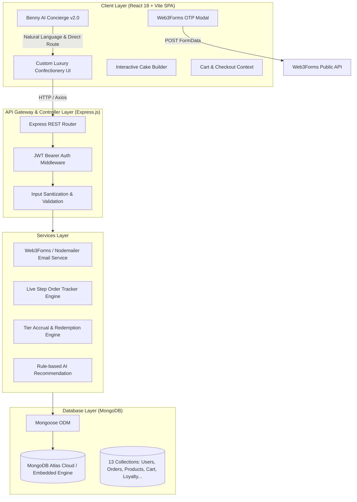

# 🍰 Smart Confectionery Management System (Sweet Haven)

> **Final-Year Academic Capstone Project**  
> **Domain:** Full-Stack Web Development, E-Commerce Operations & Cloud Architecture  
> **Tech Stack:** React (Vite), Node.js, Express.js, MongoDB (Mongoose), Web3Forms API, JWT, Vanilla CSS3

---

## 📑 Table of Contents
1. [Academic Abstract](#-academic-abstract)
2. [Problem Statement & Proposed Solution](#-problem-statement--proposed-solution)
3. [System Architecture Blueprint](#-system-architecture-blueprint)
4. [Data Flow & Working Model](#-data-flow--working-model)
5. [Core Functional Modules (7 Pillars)](#-core-functional-modules-7-pillars)
6. [Database Schema Blueprint (MongoDB Collections)](#-database-schema-blueprint-mongodb-collections)
7. [REST API Architecture](#-rest-api-architecture)
8. [Benny the Baker AI Concierge v2.0](#-benny-the-baker-ai-concierge-v20)
9. [Security & Authentication Blueprint](#-security--authentication-blueprint)
10. [Local Development & Zero-Config Setup](#-local-development--zero-config-setup)
11. [Production Cloud Deployment Guide](#-production-cloud-deployment-guide)
12. [College Evaluation & Viva Voce Q&A](#-college-evaluation--viva-voce-qa)

---

## 🎓 Academic Abstract

The **Smart Confectionery Management System (Sweet Haven)** is an enterprise-grade, end-to-end digital bakery operations platform designed to automate and optimize the retail lifecycle of high-perishability baked goods. Traditional confectionery businesses face severe operational bottlenecks: high inventory spoilage (12–18% daily waste), fragmented customer loyalty programs, absence of custom cake prototyping, and reliance on manual billing. 

Sweet Haven addresses these challenges through a unified MERN architecture incorporating an **AI-driven Concierge Bot (Benny the Baker)**, an **interactive Custom Cake Studio**, **automated Email OTP verification via Web3Forms**, a **live status food-tracking pipeline**, an **automated digital loyalty wallet**, and an **Admin Command Center with predictive waste analytics**.

---

## 🎯 Problem Statement & Proposed Solution

| Challenge in Traditional Bakeries | Sweet Haven Smart Solution |
|---|---|
| **High Perishability & Food Waste** | Admin Waste Management module tracking batch expiration, daily waste weight, and financial loss metrics. |
| **Manual / Complex Custom Orders** | Interactive Custom Cake Builder with instant real-time pricing calculation based on tiers, weight, frosting, and flavors. |
| **Weak Customer Retention** | Tiered Digital Loyalty Card (Bronze, Silver, Gold, Platinum) with automatic points accrual, redemption, and cashback rules. |
| **Static Websites with No Customer Guidance** | Smart AI Concierge ("Benny") capable of natural language queries, catalog search, order status lookups, and direct SPA routing. |
| **Unreliable Verification & OTP Costs** | Zero-cost serverless Web3Forms transactional email OTP delivery paired with signed JWT verification tokens. |

---

## 🏛️ System Architecture Blueprint



---

## 🔄 Data Flow & Working Model

### 1. User Registration & OTP Lifecycle
```text
[User Submits Form]
       │
       ▼
[Backend Generates 6-Digit Secure OTP] ──► [Stored in MongoDB with 10-Min Expiry]
       │
       ▼
[Client Dispatches FormData via Web3Forms API] ──► [Encrypted Email to User's Inbox]
       │
       ▼
[User Inputs 6-Digit OTP]
       │
       ▼
[Backend Validates Code & Hashes Password with bcryptjs (Salt: 10)]
       │
       ▼
[MongoDB Creates User & Initializes Tier-1 Loyalty Wallet]
       │
       ▼
[Signed JWT Token Returned & Persisted in LocalStorage]
```

### 2. Order Placement & Live Tracking Lifecycle
```text
[Cart Selection] ──► [Coupon Validation] ──► [Simulated Payment Gateway]
       │
       ▼
[MongoDB Creates Order Document (#SH-XXXXX)]
       │
       ▼
[Loyalty Engine Awards 1 Point per ₹10 Spent]
       │
       ▼
[Live Status Transitions: Confirmed ➔ Baking ➔ Quality Check ➔ Out for Delivery ➔ Delivered]
       │
       ▼
[Invoice Auto-Generated with Printable Luxury Branding]
```

---

## 💎 Core Functional Modules (7 Pillars)

### 1. Smart Authentication & OTP Verification
- **Dual Authentication**: Customer & Administrator login pipelines.
- **Web3Forms Integration**: Client-side serverless email delivery of 6-digit OTP codes directly to customer inboxes.
- **Password Security**: Passwords hashed with `bcryptjs` (salt rounds: 10). Session managed via `jsonwebtoken` (JWT) with configurable expiry.

### 2. Interactive Custom Cake Studio
- Real-time dynamic visual preview of cake configurations.
- Selectable parameters: **Size/Weight** (0.5kg to 5kg), **Flavor** (Belgian Chocolate, Red Velvet, Vanilla Bean, etc.), **Tiers** (1 to 3 tiers), **Frosting Type**, and **Custom Inscriptions**.
- Instant price recalculation formula:
  $$\text{Price} = (\text{Base Flavor Rate} \times \text{Weight}) + (\text{Tier Surcharge}) + (\text{Add-ons})$$

### 3. Benny the Baker — AI Concierge v2.0
- Intelligent keyword detection across 11 confectionery categories (dietary, custom orders, tracking, offers, chocolates).
- **Direct Router Navigation**: Interactive action pills that execute client-side React Router navigation (`useNavigate`) without page reloads.
- Order ID extraction: typing order numbers like `SH-84920` generates a direct live track shortcut.

### 4. Live Food-Delivery Order Tracking
- Visual step progression bar displaying active states:
  1. `Order Placed`
  2. `Baker Assigned & Mixing`
  3. `In the Oven (Baking)`
  4. `Artisan Decoration & Quality Assurance`
  5. `Out for Delivery`
  6. `Delivered to Customer`
- Displays estimated delivery time, assigned driver details, and GPS destination preview.

### 5. Digital Loyalty Card & Rewards Engine
- Automatically provisioned upon first order.
- Tier progression:
  - **Bronze**: Default tier (1% cashback points)
  - **Silver**: > 500 points (2% cashback points + free delivery)
  - **Gold**: > 1,500 points (3% cashback points + priority baking)
  - **Platinum**: > 3,000 points (5% cashback points + complimentary birthday cake)

### 6. Admin Command Center & Waste Management
- Real-time KPI metrics: Total Revenue, Active Orders, Low Stock Alerts, Customer Count.
- **Predictive Waste Reduction Log**: Tracks discarded batches, reason for spoilage (expired, damaged, shelf-life elapsed), and calculates financial loss to assist inventory forecasting.
- Product CRUD studio, order status controller, and promotional coupon builder.

### 7. Checkout & Mock Payment Gateway
- Supports Credit/Debit Cards, UPI (Google Pay, PhonePe, Paytm), Net Banking, and Cash on Delivery (COD).
- Coupon application engine validating discount thresholds and expiration dates.
- Downloadable and printable order invoice with itemized tax breakdowns.

---

## 🗄️ Database Schema Blueprint (MongoDB Collections)

The database consists of **13 normalized Mongoose collections**:

| Collection Name | Model File | Description | Key Fields |
|---|---|---|---|
| `users` | `User.js` | User and administrator credentials | `name`, `email`, `password`, `role`, `phone`, `avatar` |
| `products` | `Product.js` | Confectionery items in catalog | `name`, `slug`, `price`, `category_id`, `stock_quantity`, `is_eggless`, `is_bestseller` |
| `categories` | `Category.js` | Product taxonomy groups | `name`, `slug`, `description`, `image_url` |
| `orders` | `Order.js` | Master purchase orders | `order_number`, `user_id`, `total_amount`, `discount_amount`, `order_status`, `payment_status` |
| `cart_items` | `CartItem.js` | Real-time persisted shopping carts | `user_id`, `product_id`, `quantity`, `customization` |
| `loyalty_accounts`| `LoyaltyAccount.js`| Customer rewards wallets | `user_id`, `points_balance`, `tier_level`, `lifetime_points` |
| `loyalty_transactions`| `LoyaltyTransaction.js`| Points accrual and redemption audit trail | `account_id`, `order_id`, `points`, `transaction_type` |
| `coupons` | `Coupon.js` | Promotional discount vouchers | `code`, `discount_percentage`, `min_order_amount`, `expiry_date` |
| `offers` | `Offer.js` | Flash sales and seasonal banners | `title`, `discount_tag`, `banner_image`, `is_active` |
| `otp_verifications`| `OtpVerification.js`| Secure 6-digit OTP verification entries | `email`, `otp_code`, `purpose`, `expires_at`, `is_verified` |
| `payments` | `Payment.js` | Financial transaction audit | `order_id`, `payment_method`, `amount`, `transaction_id`, `status` |
| `notifications` | `Notification.js` | Customer & Admin broadcast messages | `user_id`, `title`, `message`, `type`, `is_read` |
| `wishlist_items` | `WishlistItem.js` | User bookmarked products | `user_id`, `product_id`, `created_at` |

---

## 🔌 REST API Architecture

All endpoints follow RESTful conventions under the base route `/api`:

```text
├── /api/auth
│   ├── POST /send-otp              # Generate OTP & dispatch email
│   ├── POST /verify-otp            # Validate 6-digit OTP token
│   ├── POST /customer/register     # Customer registration with verified OTP
│   ├── POST /customer/login        # Customer login & JWT issuance
│   └── POST /admin/login           # Admin credentials authentication
├── /api/products
│   ├── GET  /                      # Fetch catalog with category & dietary filter
│   ├── GET  /:id                   # Fetch single product details
│   ├── POST /                      # [Admin] Create new confectionery item
│   ├── PUT  /:id                   # [Admin] Update item details / stock
│   └── DELETE /:id                 # [Admin] Archive product
├── /api/orders
│   ├── POST /                      # Create order from checkout
│   ├── GET  /my-orders             # Customer order history
│   ├── GET  /track/:orderNumber    # Live status lookup (public & protected)
│   └── PUT  /:id/status            # [Admin] Advance cooking/delivery state
├── /api/cart                       # Full CRUD for persistent shopping cart
├── /api/loyalty                    # Wallet balance, tier status & points redemption
├── /api/coupons                    # Coupon validation & discount evaluation
├── /api/admin/dashboard            # Analytics KPIs, waste logs & sales distribution
└── /api/waste                      # Food waste recording & spoilage cost metrics
```

---

## 🤖 Benny the Baker AI Concierge v2.0

Benny is designed as a luxury bakery assistant with state machine logic and context-aware natural language matching:

- **Smart Response Mapping**: Matches user intent across 11 primary topics.
- **Dynamic Navigation Pills**: Produces clickable buttons that route through the SPA:
  - `"Show me cakes"` ➔ Returns message + `[🛍️ Explore Cake Catalog]` pill (`/products`)
  - `"Where is my order?"` ➔ Returns message + `[🚚 Open Live Tracker]` pill (`/track`)
  - `"I want custom design"` ➔ Returns message + `[🎂 Open Custom Studio]` pill (`/custom-cake`)
- **Order ID Parser**: Automatically regex-matches `#SH-XXXXX` and outputs a dedicated tracking pill for that specific purchase.

---

## 🔒 Security & Authentication Blueprint

1. **Password Hashing**: `bcryptjs` with salt round factor of `10`. Plaintext passwords are never saved.
2. **Stateless JWT Authorization**: API routes are guarded by `authenticateToken` middleware that validates `Bearer <token>` headers.
3. **OTP Verification Expiration**: OTP records in MongoDB feature automatic TTL indexing (`expires_at`), self-expiring within 10 minutes.
4. **Environment Protection**: Sensitive keys (`JWT_SECRET`, `MONGO_URI`, `WEB3FORMS_ACCESS_KEY`) are secured via `.env` and excluded from source control via `.gitignore`.
5. **CORS & Proxy Security**: Development proxy configured via Vite (`/api` ➔ `localhost:5000`) preventing cross-origin request forgery.

---

## 💻 Local Development & Zero-Config Setup

### Prerequisites
- [Node.js](https://nodejs.org/) (v18.0.0 or higher)
- [Git](https://git-scm.com/)

### 1. Clone the Repository
```bash
git clone https://github.com/Deepaveera3/smart-confectionery-management-system.git
cd smart-confectionery-management-system
```

### 2. Install Dependencies
```bash
# Install frontend dependencies
npm install

# Install backend dependencies
cd server
npm install
cd ..
```

### 3. Environment Setup
The project comes with zero-configuration fallback defaults. To customize, create `.env` in the root and `server/.env`:

```env
# server/.env
PORT=5000
NODE_ENV=development
JWT_SECRET=sweethaven_super_secret_jwt_key_2026
MONGO_URI=mongodb://localhost:27017/sweet_haven_db
CLIENT_URL=http://localhost:5173
WEB3FORMS_ACCESS_KEY=your_web3forms_access_key_here
```

> **Note on MongoDB**: If an external MongoDB server is not running, the application automatically launches a **built-in in-memory MongoDB engine**, pre-populates initial products, categories, coupons, and admin accounts without manual setup!

### 4. Run the Application
Open two terminal windows:

**Terminal 1 (Backend Server):**
```bash
cd server
node index.js
# Runs at: http://localhost:5000
```

**Terminal 2 (Frontend Client):**
```bash
npm run dev
# Runs at: http://localhost:5173
```

---

## ☁️ Production Cloud Deployment Guide

### Deploying Frontend (Vercel)
1. Push your repository to GitHub.
2. Log in to [Vercel](https://vercel.com) and click **"Import Project"**.
3. Set **Framework Preset**: `Vite`.
4. Set **Root Directory**: `./`.
5. Under **Environment Variables**, add:
   - `VITE_API_BASE_URL`: `https://your-backend-service.onrender.com/api`
6. Click **Deploy**. (The included `vercel.json` ensures all SPA routes redirect cleanly to `index.html`).

### Deploying Backend (Render / Railway)
1. In [Render](https://render.com), create a **New Web Service**.
2. Connect your GitHub repository.
3. Set **Root Directory**: `server`.
4. Set **Build Command**: `npm install`.
5. Set **Start Command**: `node index.js`.
6. Add Environment Variables:
   - `NODE_ENV`: `production`
   - `PORT`: `5000`
   - `JWT_SECRET`: `your_secure_random_string`
   - `MONGO_URI`: `mongodb+srv://<username>:<password>@cluster0.otaxsor.mongodb.net/sweet_haven_db?retryWrites=true&w=majority`
   - `CLIENT_URL`: `https://your-frontend.vercel.app`
   - `WEB3FORMS_ACCESS_KEY`: `your_web3forms_key`
7. Click **Deploy**.

---

## 🎓 College Evaluation & Viva Voce Q&A

**Q1: Why did you migrate from relational SQL to MongoDB?**  
*Answer:* Confectionery orders, custom cake configurations, and loyalty logs are highly polymorphic. MongoDB's document model natively supports flexible JSON structures (e.g. customized ingredients, dynamic cake tiers, embedded delivery timeline checkpoints) and allows zero-downtime schema evolution.

**Q2: How does the email OTP authentication work without an SMTP server?**  
*Answer:* The client dispatches a serverless `POST` request to the Web3Forms API using `FormData`. The backend securely generates and records the OTP with a 10-minute validity timestamp in MongoDB. Once the user submits the code, the backend verifies the hash and issues an authenticated JWT token.

**Q3: How does the system handle concurrent cart operations?**  
*Answer:* Cart items are bound to composite indices (`user_id` + `product_id`). Adding an existing item performs an `$inc` update operation in MongoDB, preventing duplicate rows and race conditions.

**Q4: How does the platform reduce bakery food waste?**  
*Answer:* The Admin Waste Management module records product expiration timestamps and daily unsold surplus. These records feed into the analytics dashboard, giving the baker data on which products overproduce and calculating the net financial loss.

---

## 👥 Contributors & Academic Credits
- **Project Lead & Developer:** Deepaveera3
- **Institution:** Department of Computer Science & Engineering
- **Academic Year:** 2025–2026
- **License:** MIT License — Open for academic demonstration and research.
